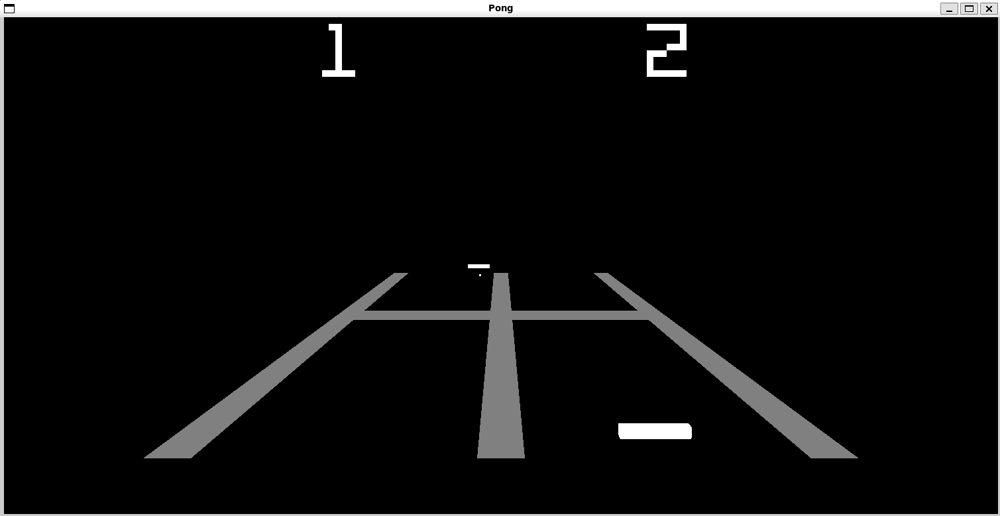

# Pong

<!-- Reserve space of an image of the game -->

I've been steadily going through [this site](https://learnopengl.com/) to learn OpenGL. One day, the site was down (restored within a day), so I decided to test what I already knew and make Pong from scratch with OpenGL. This is the result.

"Art" and text were created using [GIMP](https://www.gimp.org/). Sound effects were created using [jsfxr](https://sfxr.me/). The [game over tune](resources/audio/gameover.wav) was made with [FamiStudio](https://famistudio.org/).

## Compiling

### Linux

Before running `make`, you'll need to ensure you have SFML's audio component and GLFW installed. You can obtain both with the following commands or by following the links to their respective websites.

[SFML](https://www.sfml-dev.org/development.php)

	sudo apt-get install libsfml-dev

[GLFW](https://www.glfw.org/)

	sudo apt-get install libglfw3
	sudo apt-get install libglfw3-dev

Other dependencies that are already included in the repository can be found in the [include](include) directory.

To complete the compilation, simply run the makefile with

	make

Your executable will be found at `bin/pong`.

## How to Play

Upon launching the game, you'll see a static pong window where the score at the top of the window is set to 1 for both players. This is not a score at this point! This is the number of players. Use your number `1` and `2` keys to change the number of players, and press `Enter` when ready to play. If you choose to play in single player mode, you will be controlling the near paddle.

The near paddle is controlled using the `A` and `D` keys to move near and right respectively. The same is true for the far paddle using the `LEFT` and `RIGHT` arrow keys. Press the `ESC` key to close the application.

Each time the ball hits a paddle, the ball's speed will increase. The player that most recently lost a point will be given the first serve of the next round. The near player will always start with the first serve of the game.

The winner is the first to get to 10 points.
