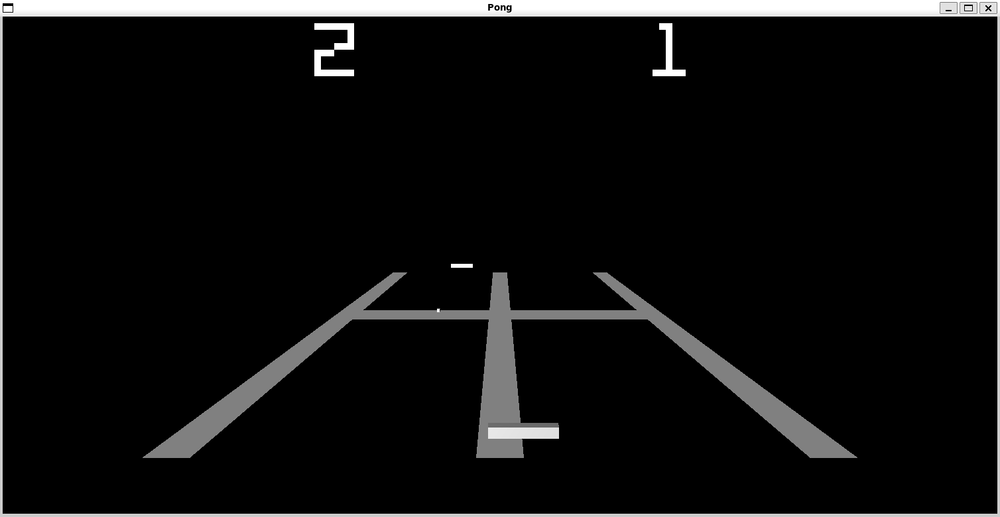

# Pong

<!-- Reserve space of an image of the game -->

Pong created entirly from scratch with OpenGL. All "art", sound, and even the font was created by me.

## Getting Started
<!-- Install dependancies -->

## Compiling
<!-- Explain compile instructions -->

## Have Fun!
<!-- Run the game and play it! -->